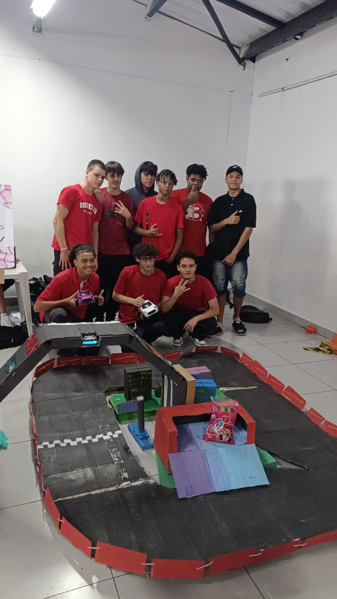

# 🤖 Sistema de Controle de Carrinho por Plano Cartesiano com Micro:bit

## 📘 Feira de Ciências / Projeto de Robótica Educacional (2025)

---

## 🏫 Contexto

Este projeto foi desenvolvido em 2025 durante atividades escolares, com orientação de um professor de tecnologia.

O objetivo foi aplicar conceitos de robótica, programação embarcada e controle de movimento na prática, utilizando sensores e comunicação sem fio.

---

## 🎯 Objetivo

Desenvolver um sistema capaz de controlar um carrinho robótico através de movimentos interpretados em um plano cartesiano, utilizando aceleração nos eixos X e Y.

---

## ⚙️ Descrição do Sistema

O projeto é composto por dois dispositivos:

### 📡 Controlador (Micro:bit emissor)
Responsável por:
- Ler o acelerômetro (eixos X e Y)
- Interpretar movimento no plano cartesiano
- Converter dados em valores de velocidade
- Enviar comandos via rádio

### 🚗 Carrinho (Micro:bit receptor)
Responsável por:
- Receber os dados via rádio
- Controlar motores independentes
- Ajustar direção e velocidade em tempo real

---

## 📊 Princípio de Funcionamento

O sistema utiliza o conceito de **controle vetorial simplificado**:

- Eixo Y → movimento frente/trás
- Eixo X → rotação/direção
- Combinação X + Y → curvas e ajustes de trajetória

Os valores são convertidos em velocidade para motores:

- Motor esquerdo (mEsq)
- Motor direito (mDir)

---

## 📡 Comunicação

A comunicação entre os dispositivos é feita via rádio utilizando o micro:bit:

- `"mEsq"` → controle do motor esquerdo
- `"mDir"` → controle do motor direito

---

## 🔌 Componentes Utilizados

- 2x :contentReference[oaicite:1]{index=1}  
- 4 motores DC  
- Driver de motor (Robotbit)  
- 2 estruturas de carrinho  
- Protoboard  
- Bateria portátil  
- Cabos jumper  

---

## 🧠 Conceitos Aplicados

- Plano cartesiano (X, Y)
- Controle diferencial de motores
- Sistemas embarcados
- Comunicação sem fio (rádio)
- Conversão de sinais analógicos em digitais

---

## 📸 Demonstração do Projeto

### 📡 Grupo e pista

### 🚗 Carrinho e luva

---

## 🚀 Resultados

O sistema conseguiu:

- Interpretar movimentos em tempo real
- Converter aceleração em direção e velocidade
- Controlar dois motores de forma independente
- Executar comandos via comunicação sem fio

---

## 📈 Possíveis melhorias

- Implementação de filtro para suavizar movimentos
- Interface gráfica de calibração
- Controle via aplicativo mobile
- Aumento de precisão no mapeamento do acelerômetro
- Redução de latência na comunicação

---

## 👨‍🏫 Créditos

Projeto desenvolvido por estudante com apoio de professor durante atividades escolares (2025).

---

## 👨‍💻 Autor

Projeto pessoal de aprendizado em robótica e programação embarcada.
